```{r, echo=FALSE}
library(metathis)
meta() %>% 
  meta_description(params$event) %>% 
  meta_name("github-repo" = paste0("datactivist/", params$slug)) %>% 
  meta_viewport() %>% 
  meta_social(
    title = params$title,
    url = paste0("https://datactivist.coop/", params$slug),
    image = params$image,
    image_alt = params$image_alt,
    og_type = "website",
    og_author = "Datactivist",
    og_locale = "fr_FR",
    og_site_name = "Datactivist",
    twitter_card_type = "summary",
    twitter_creator = "@datactivi_st")

```

layout: true

<style>
.remark-slide-number {
  position: inherit;
}

.remark-slide-number .progress-bar-container {
  position: absolute;
  bottom: 0;
  height: 4px;
  display: block;
  left: 0;
  right: 0;
}

.remark-slide-number .progress-bar {
  height: 100%;
  background-color: #e95459;
}

</style>


`r paste0("<div class='my-footer'><span>", params$event, "</span> <center><div class=logo><a href='https://datactivist.coop/'></a></div></center></span></div>")` 


---

class: center, middle

Ces slides en ligne : `r paste0("http://datactivist.coop/", params$slug)`

Sources : `r paste0("https://github.com/datactivist/", params$slug)`


Les productions de Datactivist sont librement réutilisables selon les termes de la licence [Creative Commons 4.0 BY-SA](https://creativecommons.org/licenses/by-sa/4.0/legalcode.fr).

<BR>
<BR>


---
class: inverse, center, middle

### 8 choses incroyables qui n'auraient pas existé sans l'open data

---
class: inverse, center, middle

# 1. Yuka

.center[]

---


---
## Yuka 

### 8,5 millions d'utilisateurs
### 2 millions de produits scannés chaque jour
### Top 10 des applis gratuites sur l'Appstore et le Playstore

---

# test


---
class: inverse, center, middle

# 2. Pokemon go 

.center[]

---

[.center[]](https://teamopendata.org/t/pokemon-go-migre-sur-openstreetmap/113)


---
## OpenStreetMap


---
class: inverse, center, middle

# 3. Une carte de la pollution de l'air dans les écoles

---

[](https://carte-des-ecoles.de-l-air-pour-nos-enfants.fr/)

---

[](https://www.data.gouv.fr/fr/datasets/base-de-donnees-de-la-pollution-aerienne-aux-abords-des-ecoles-et-creches-dile-de-france/)

---
class: inverse, center, middle

# 4. Les applis de mobilité

---
## Les applis de mobilité


.center[.reduite[]]

---
## Les applis de mobilité

.center[.reduite[]]

---
class: inverse, center, middle


# 5. Les prix de l'immobilier 

---

[.center[]](https://www.meilleursagents.com/prix-immobilier/dvf/)

---
## Une réutilisation rendue possible par l'ouverture de données publiques

[.center[]](https://www.data.gouv.fr/fr/reuses/explorateur-de-biens-vendus/)

---
## 6. Les tests Covid

.pull-left[
Le **5 janvier 2020**, 5 jours après l'annonce par la Chine d'un nouveau virus, les données du génome du SARS COV-2 ont été publiées dans la base internationale de données génétiques, GenBank.

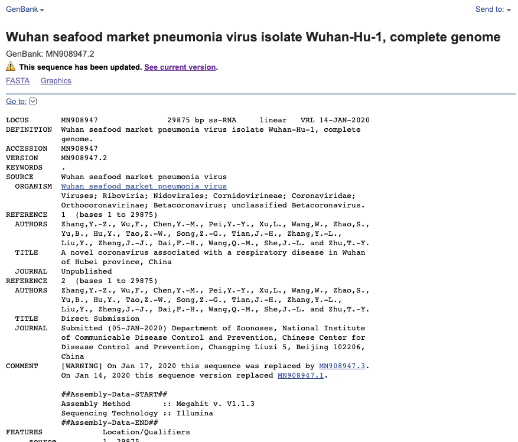
]

.pull-right[
Le **13 janvier 2020**, sur la base de ces données, une équipe de recherches allemande crée le premier test PCR de dépistage de la Covid-19. 

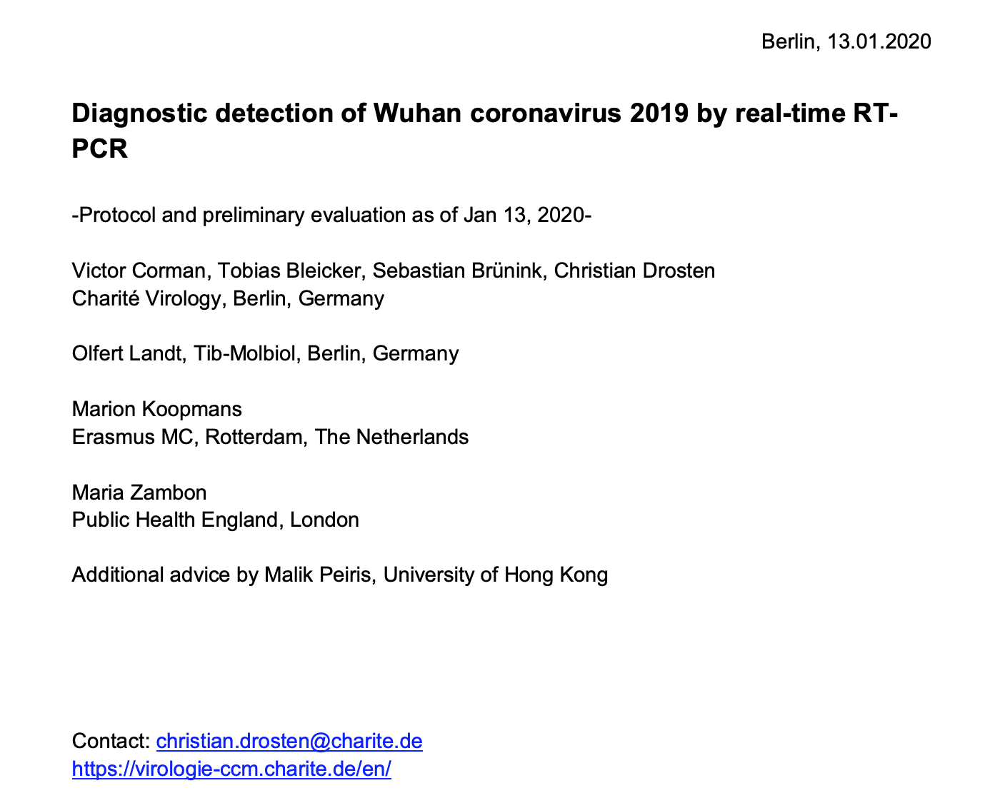

]

.footnote[Source : Wikipedia, [chronologie de la pandémie de Covid-19](https://en.wikipedia.org/wiki/Timeline_of_the_COVID-19_pandemic_in_January_2020)]

---
## 7. Les tableaux de bord de la Covid

.center.reduite[
[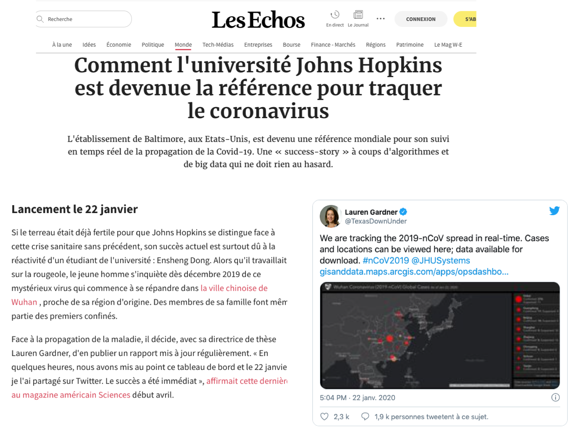](https://www.lesechos.fr/monde/etats-unis/comment-luniversite-johns-hopkins-est-devenue-la-reference-pour-traquer-le-coronavirus-1224856)
]

---
## 7. Les tableaux de bord de la Covid

.reduite.center[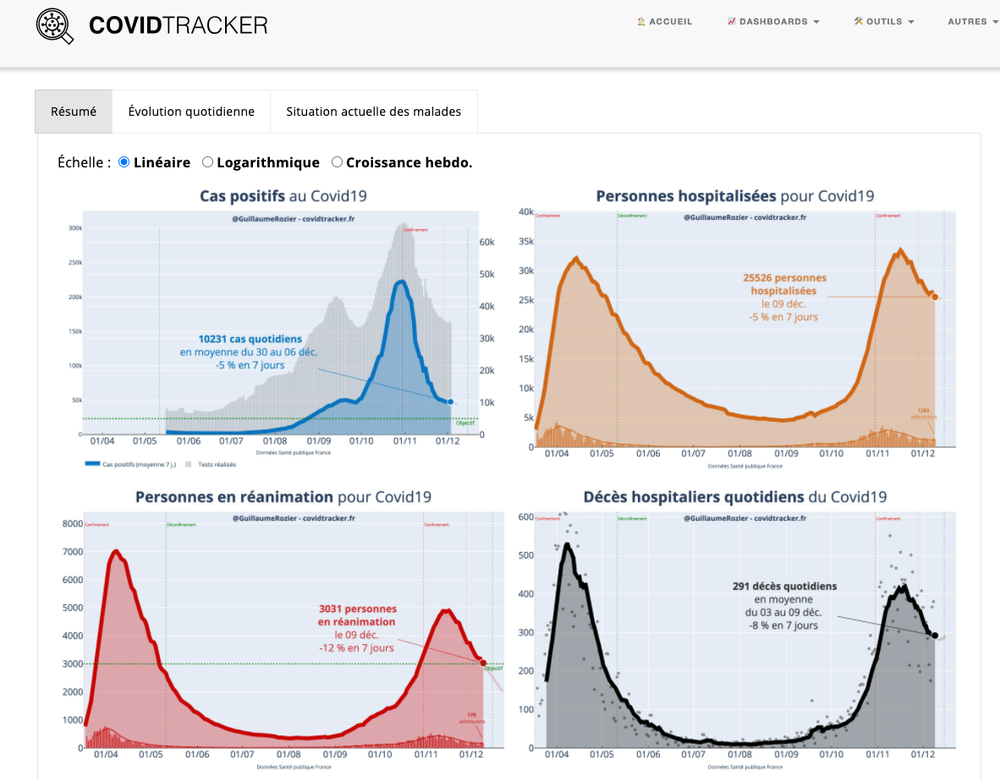](https://covidtracker.fr/covidtracker-france/)

---
class: inverse, center, middle


# 8. Et pour finir... des plantes !

---
## 8. Plantnet

.reduite.center[
[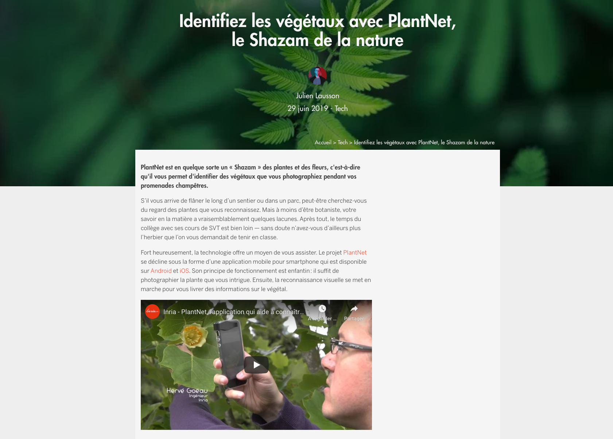](https://www.numerama.com/tech/281269-lapplication-plantnet-le-shazam-des-plantes-et-des-fleurs.html)
]

---
## 8. Plantnet
.reduite.center[
[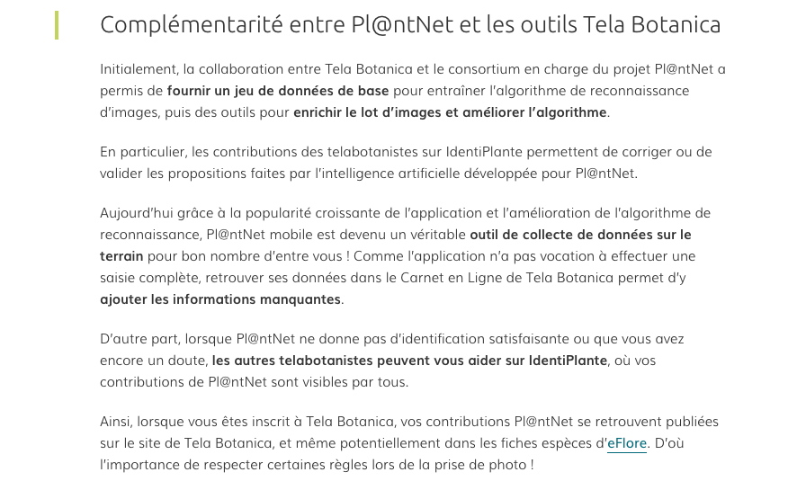](https://www.tela-botanica.org/2018/10/plantnet-mobile-sur-votre-ordinateur/)
]


---
class: inverse, center, middle


# Rappel des principes, contexte et cadre juridique de l'open data


---
### [.red[L'open data : ]](https://books.openedition.org/cdf/5005?lang=fr) une notion aux multiples facettes

.reduite.center[]

---
### Des principes techniques qui se sont imposés


.reduite[]
---

### Loi pour une République Numérique : l'ouverture des données .red[par défaut]


.left-column[
Une obligation pour les collectivités de **+50 agents et 3500 habitants**

Un .red[**périmètre très large**] : les "bases de données", les données qui présentent "un intérêt économique, social, sanitaire ou environnemental"

]

.right-column[
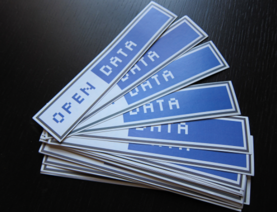]

---
### Loi pour une République numérique : une limitation des .red[licences]
.left-column[


La licence ouverte ou la licence ODBL limitées par décret

Une démarche d’homologation des licences pour sortir de ce cadre

]
.right-column[
[](http://www.opendatalab.fr/index.php/laboratoire/le-kit-collectivites)

.footnote[source : [SGAR Occitanie](http://www.opendatalab.fr/index.php/laboratoire/le-kit-collectivites)]
]


---
### Loi pour une République numérique : l'utilisation de .red[standards ouverts]

.left-column[

Mettre à disposition les données **"dans un standard ouvert, aisément réutilisable et exploitable par un système de traitement automatisé"**. 
]

.right-column[
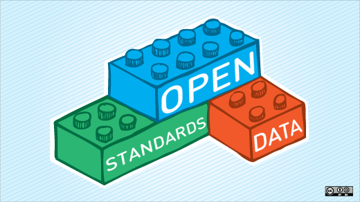

Concrètement, éviter la publication de fichiers PDF là où un fichier CSV pourrait être diffusé.
]
---
class: inverse, center, middle

# Les bénéfices de l'ouverture des données

---
### Valoriser le travail d’une administration ou d’une entreprise

Le département de la Gironde a produit un travail de visualisation et d'explication du budget en 2019 à partir de ses données ouvertes ([source](https://www.gironde.fr/un-budget-au-service-des-solidarites-humaine-et-territoriale)). 

.reduite[.center[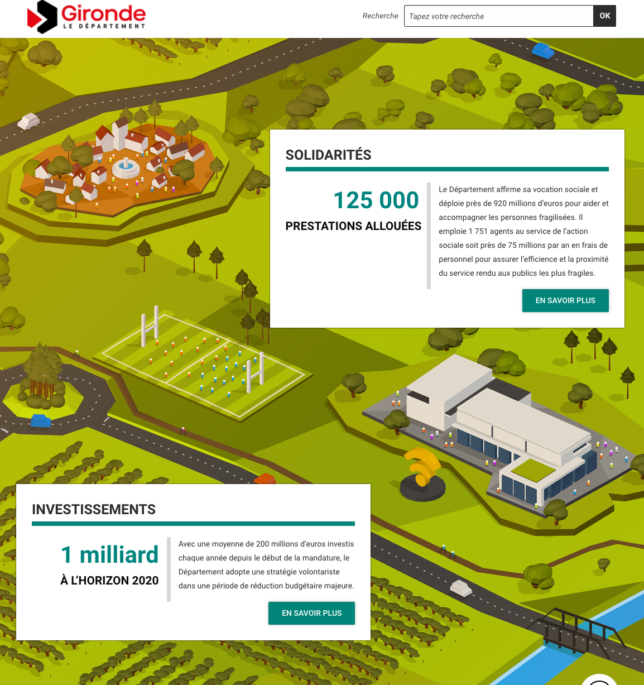]]


---
### Valoriser le travail d’une administration ou d’une entreprise

Le département de la Gironde a produit un travail de visualisation et d'explication du budget en 2019 à partir de ses données ouvertes ([source](https://www.gironde.fr/un-budget-au-service-des-solidarites-humaine-et-territoriale)). 

.pull-left[
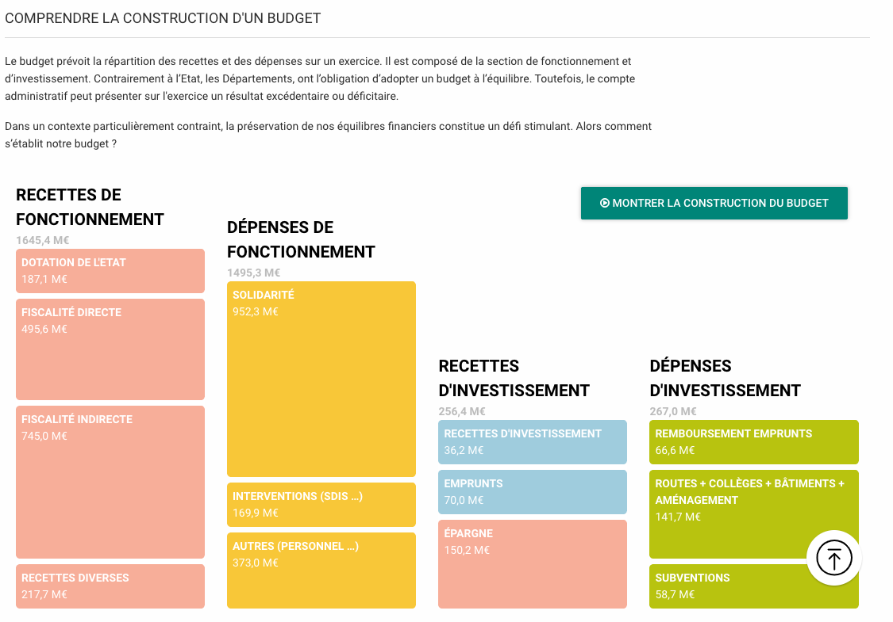
]

.pull-right[
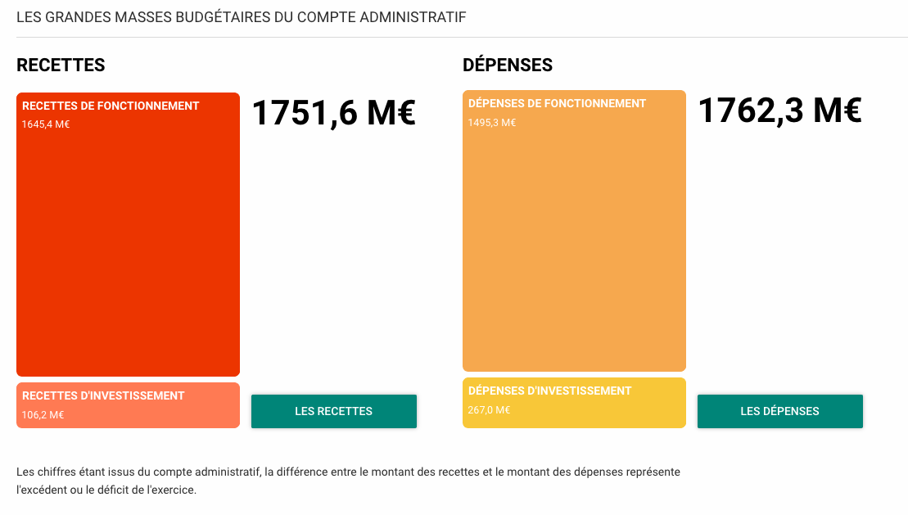
]

---
### Faire gagner du temps aux différents services

Répondre moins souvent aux demandes individuelles du fait de la publicité des données	: 

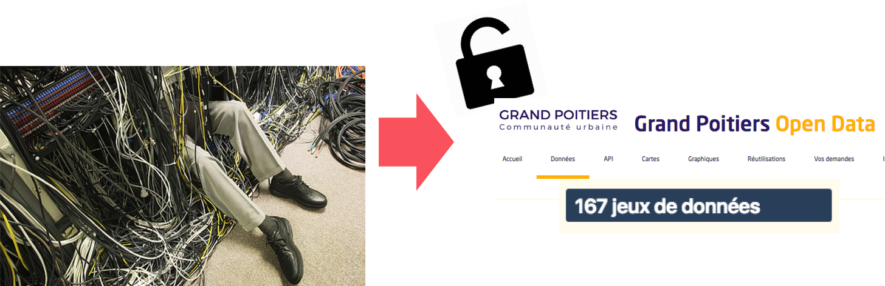

---
### Ouvrir les possibilités de croisements de données

Exemple des vélos en libre service à New York : confronter modèles et usages


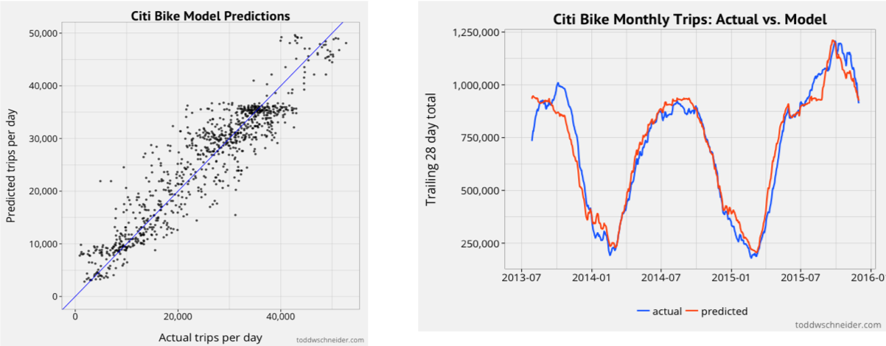

---
### Améliorer la qualité des données

.pull-left[

#### En donnant de la visibilité aux données

#### + d’audience 

#### = + de corrections
			
]


.pull-right[

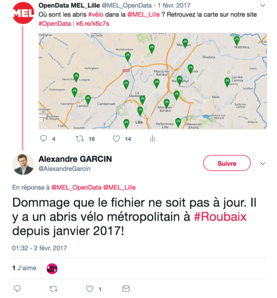
]

---
### Améliorer la qualité des données

Grâce à la comparaison de données ouvertes : exemple à Poitiers

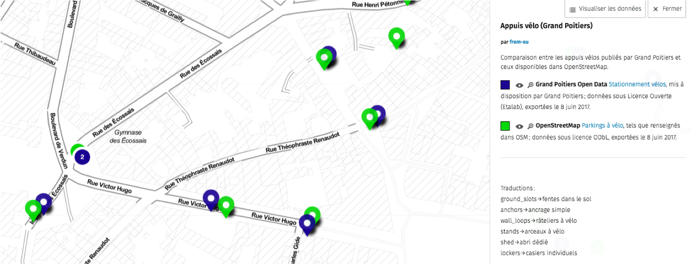
---

### Révéler des enjeux de souveraineté sur les données et des SI 

.pull-left[
* Connaître les données dont on est propriétaire

* Savoir qui est légitime pour les mettre à jour

* Connaître les données qu’on ne possède pas

* Créer des liens (API) avec les partenaires, délégataires, prestataires

* Négocier des accès aux données (échanges)

]

.pull-right[
.reduite[]
]

---
### Pour la transparence de l’action publique 

La transparence : pilier pour la démocratie

.reduite.center[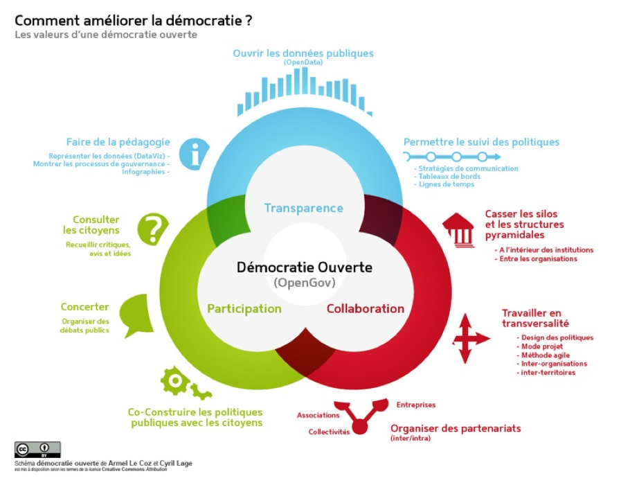]


---
### Pour la transparence de l’action publique

Une action publique plus claire. Exemple à [Issy-les-Moulineaux](https://data.issy.com/pages/tableaux-de-bord-issy/) : 

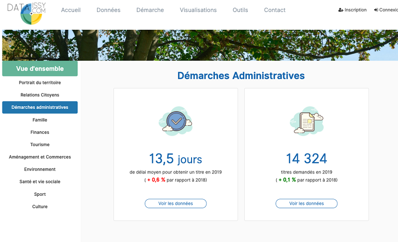]

---
### Pour impliquer davantage les citoyens dans la production des données

Exemple de [CartoQuartiers à Nantes](https://www.cartoquartiers.fr/)

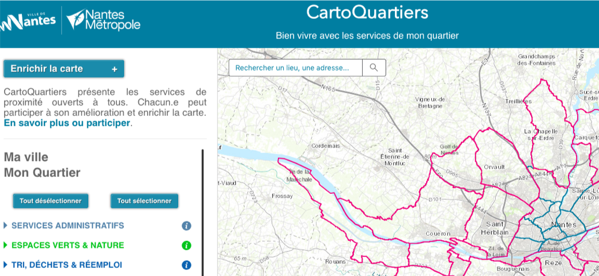]

---
### Pour être plus forts ensemble, et plus souverains sur nos données

[MapCompare](https://tools.geofabrik.de/mc/#17/43.5032/5.3828&num=4&mt0=mapnik&mt1=google-map&mt2=mapnik-german&mt3=here-map) : comparer OSM, Google Maps et Here Maps

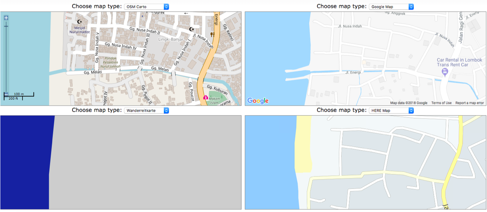

---
### Pour être plus forts ensemble, et plus souverains sur nos données


---
### Pour le data journalisme


---
### Pour le data journalisme

.reduite[.center[]]

---
### Pour permettre le développement de  nouveaux services

#### …mais garder en tête que l’open data est un investissement de long terme 

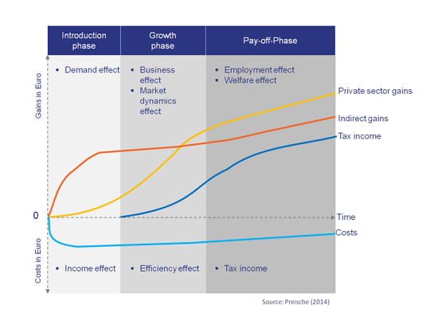


---
### Pour permettre le développement de  nouveaux services

[](http://citizenclan.org)

---
### Pour permettre le développement de  nouveaux services

[](http://handisco.com)

---
### Pour permettre le développement de nouveaux services

[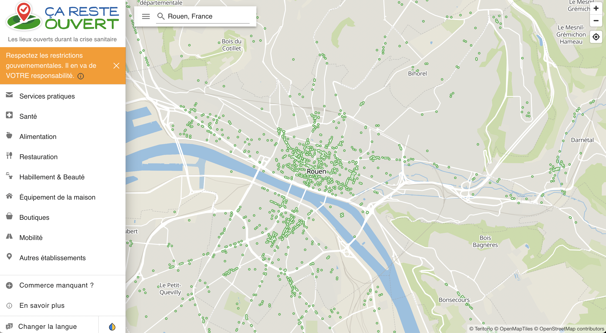](https://caresteouvert.fr/@49.441282,1.090981,12.90)

---
### Pour permettre le développement de nouveaux services

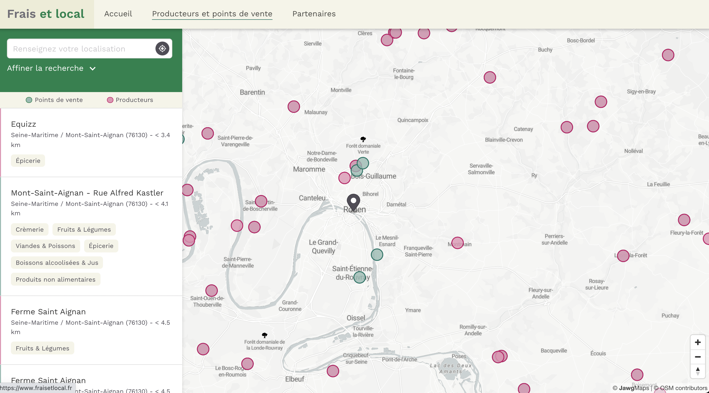
---
### Pour améliorer l’efficience des services 

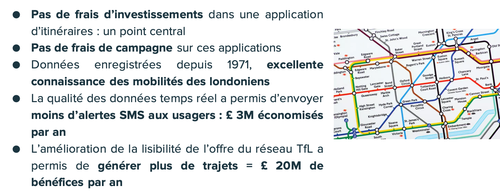
---
### Les bénéfices de l'open data .red[en résumé]

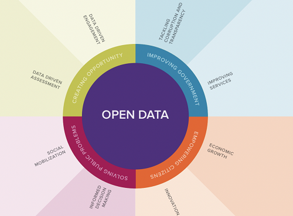

.footnote[source : [GovLab](https://thegovlab.org/static/files/publications/open-data-impact-key-findings.pdf)]

---
class: inverse, center, middle

# Les facteurs clés de succès d'un projet d'open data 

---


---
class: inverse, center, middle

# Merci !

Contact : [samuel@datactivist.coop](mailto:samuel@datactivist.coop)


